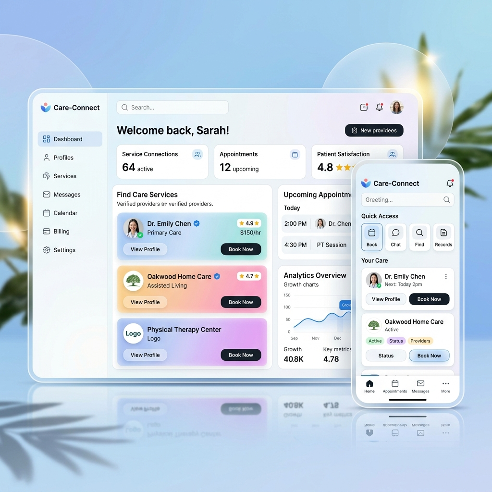

# ASHOK SAHANI | Kinetic Art & Product Engineering



A high-end, premium portfolio designed for the next generation of digital leaders. This project showcases a "Classic Modern" aesthetic, combining architectural structure with fluid kinetic motion to create an editorial-grade user experience.

## ✨ Core Philosophy
This portfolio is not just a showcase of work; it is a demonstration of **Product Engineering**. Every interaction, from the 3rem rounded corners to the glassmorphic VideoModal, is crafted to reflect a startup-ready standard of quality.

## 🚀 Key Features
- **Classic Modern Aesthetic**: A custom design language featuring high-contrast typography, deep surfaces, and bold 3rem border radii.
- **Dynamic Case Studies**: Editorial-grade layouts for 5 core projects, with deep-dives into Problem, Goal, Strategy, and Technical Stack.
- **Multi-Source Video Demos**: A robust `VideoModal` component supporting both YouTube embeds and high-performance local MP4 playback.
- **Kinetic Interactions**: Powered by **Framer Motion** and **GSAP**, featuring smooth parallax effects, magnetic buttons, and staggered entries.
- **Next.js 15 (App Router)**: Utilizing React 19 features, Server Components, and optimized client-side navigation.
- **Responsive Mastery**: A fluid experience across mobile, tablet, and ultra-wide displays.

## 🛠️ Technical Stack
- **Framework**: [Next.js 15](https://nextjs.org/)
- **Styling**: [Tailwind CSS](https://tailwindcss.com/)
- **Animations**: [Framer Motion](https://www.framer.com/motion/), [GSAP](https://gsap.com/)
- **Icons**: [Lucide React](https://lucide.dev/)
- **Scrolling**: [Lenis](https://github.com/darkroomengineering/lenis)
- **Deployment**: [Vercel](https://vercel.com/)

## 📂 Project Structure
```bash
├── app/                  # Next.js App Router (Pages & Layouts)
├── components/           # Reusable UI Components (VideoModal, Portfolio, etc.)
├── data/                 # Project Metadata & Content (Single Source of Truth)
├── public/               # Static Assets (Images & Local Demo Videos)
└── styles/               # Global CSS & Design Tokens
```

## 🎥 Project Demos
The portfolio features 5 specialized AI and SaaS demonstrations linked directly to the "Watch Demo" buttons:
1. **Care-Connect**: Healthcare & Service Connection Platform.
2. **AgriVaani AI**: Smart Farming Assistant.
3. **WhatsApp AI Agent**: Business Automation System.
4. **DataFlow Scraping SaaS**: Structured Data Extraction.
5. **AI Career OS**: Integrated Career Growth Engine.

## 🛠️ Getting Started

1. **Clone the repository:**
   ```bash
   git clone https://github.com/AshokSahani7390/My_Portfolio.git
   ```

2. **Install dependencies:**
   ```bash
   npm install
   ```

3. **Run the development server:**
   ```bash
   npm run dev
   ```

4. **Build for production:**
   ```bash
   npm run build
   ```

## ✉️ Contact
Built with precision by **Ashok Sahani**.
- **LinkedIn**: [Ashok Sahani](https://www.linkedin.com/in/ashok-sahani-b38b94305)
- **Instagram**: [@ashoksahani7390](https://www.instagram.com/ashoksahani7390)
- **Email**: [ashoksahani2004@gmail.com](mailto:ashoksahani2004@gmail.com)

---
*Created for the visionary. Built to scale.*
